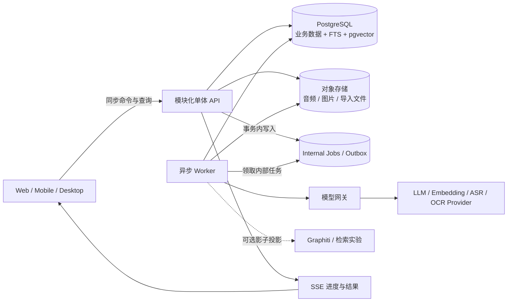
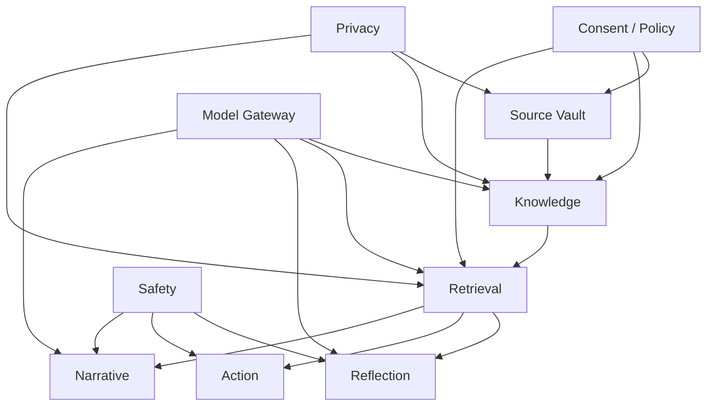

# 后端功能架构

## 1. 架构目标

首版需要同时满足四个看似冲突的目标：记录时足够快、后台理解足够深、推断可被用户审计、未来可替换模型与检索引擎。解决办法是把“保存原文”和“理解原文”拆成两条路径。



同步路径只负责鉴权、校验、加密保存、版本与任务入队。模型失败不会让用户丢失记录。所有耗时理解都在 Worker 中进行，并可安全重试。

## 2. 逻辑域划分

### 2.1 Identity

职责：账号、设备、会话、OIDC 登录、租户边界、数据 vault。

关键规则：

- 每条业务记录必须带 `vault_id`；业务层不能从客户端自由指定其他人的 vault。
- API/Processor 只在数据库事务内使用 `SET LOCAL app.vault_id`；业务角色不是表 owner、无 `BYPASSRLS`，关键表启用 `FORCE ROW LEVEL SECURITY`。连接归还池前不得残留 session-level scope。
- 全局 Dispatcher 只能扫描无正文的 job 元数据并领取 `(job_id, vault_id, lease_generation)`；Processor 随后以单 vault 受限角色处理。API、Worker、migration、管理角色和连接池复用都进入隔离测试。
- 支持注销单设备、轮换密钥与全账号导出/删除。

### 2.2 Consent & Policy

职责：同意版本、功能级数据许可、模型供应商策略、敏感主题设置、主动提醒时段。

同意不是一个总开关，至少拆成：

- 云端模型处理；
- 长期记忆；
- 跨记录模式分析；
- 回忆录纳入某个来源或时间段；
- 主动提醒；
- 第三方任务/日历同步；
- 匿名产品改进数据（默认关闭且与服务使用分离）。

每次策略变更递增 `policy_epoch`，每次 Source 修改/删除递增 `source_generation`。Worker 在取数据前、每次外部模型调用前和提交派生结果前都重新比较；不匹配时取消/丢弃结果。这样撤回同意不仅拦住排队任务，也为运行中任务建立写入栅栏。

### 2.3 Source Vault

职责：文本、语音、图片、对话、文件导入；原始内容版本；附件；片段寻址。

原则：

- 原始修订不可变；编辑会创建新 revision，并让旧 revision 退出当前态。
- 用户删除时先从所有读取路径隐藏，再异步物理级联。
- 片段 `SourceFragment` 是内部证据锚点，不要求用户用块编辑器。
- 导入内容必须预览并明确确认，不能静默把整个云盘或聊天历史纳入人格分析。

### 2.4 Knowledge

职责：派生记忆、人物、事件、地点、关系、主题、目标、价值候选、证据与反证、版本和用户裁定。

这是产品的核心信任域。第三方 memory/graph 包不能直接写本域表，只能通过 `CandidateProposal` 接口提交候选。

### 2.5 Retrieval

职责：将问题变成检索计划，融合全文、向量、实体、时间和状态，输出带来源的 `ContextPack`。

必须保证：

- 先执行 vault、同意、敏感等级、删除状态和时间范围过滤，再做相似度排序；
- 重要判断同时寻找支持证据与反证；
- 返回证据 span，不只返回摘要；
- 未确认的高风险假设默认不进入行动建议或主动提醒上下文。

### 2.6 Reflection

职责：从多条记录提出可检验洞察、开放式问题、阶段回顾。

输出是 `InsightCandidate`，而不是“系统发现的真相”。它包含：观察、证据、反证/不确定性、一个可选问题、有效期限和生成方法。用户可以确认、修正、驳回或暂不处理。

### 2.7 Action & Experiment

职责：区分明确承诺、愿望、灵感、关切与建议；管理用户选择的小行动及复盘。

系统可以提出候选，但只有用户确认后才创建内部任务；同步日历、发送消息等外部副作用需要单独确认和可撤销授权。

### 2.8 Narrative

职责：时间线、人生章节、主题线、回忆录项目、引用、草稿版本和导出。

回忆录不是一次长 prompt：先定范围和隐私，再生成可审查提纲，为每章冻结证据包，逐章起草、核查日期/人物/引文，最后由用户编辑与发布。文学性推断不得反写 Knowledge。

### 2.9 Safety

职责：输入和输出的风险分流、危机时的安全回应模板、创伤内容再呈现政策、临床边界。

Safety 不是一个单独 prompt，而是模型调用前后的策略网关；详见 [05-psychology-and-safety.md](./05-psychology-and-safety.md)。

### 2.10 Privacy & Data Rights

职责：查看“系统知道什么”、来源解释、记忆编辑/撤回、导出、删除、保留策略与审计。

这是一级产品模块，不是管理后台附属功能。

### 2.11 Model Gateway

职责：按任务选择模型/供应商；结构化输入输出；超时、重试、预算、脱敏、审计和降级。

模型按能力拆分：

- OCR / ASR；
- 片段分类与结构化抽取；
- 时间解析与实体消歧；
- 证据一致性验证；
- embedding；
- 对话与反思；
- 长文规划与生成；
- 输入/输出安全分类。

业务模块只依赖任务接口，不依赖某家模型 SDK。

## 3. 物理部署建议

### 3.1 MVP

```text
1 × API container
1 × Worker container（可按队列增加副本）
1 × PostgreSQL（启用 pgvector）
1 × S3-compatible object storage
1 × KMS / Secret Manager
1 × OpenTelemetry collector + logs/metrics backend
```

建议实现栈：Python + FastAPI + Pydantic + SQLAlchemy/Alembic。理由是结构化 AI 管线和评测生态成熟，并可让 API 与 Worker 共享领域代码。若团队已统一 TypeScript，可用等价框架实现；领域边界和数据契约比语言更重要。

MVP 不要求 Redis。短期缓存可进程内完成，幂等、任务和限流状态放 PostgreSQL；确有跨实例高频缓存需求后再引入。

### 3.2 扩展触发条件

| 触发条件 | 扩展动作 |
|---|---|
| ASR/OCR 占满通用 Worker | 拆出 media queue 与独立 worker pool |
| 夜间 reflection 造成模型限流 | 按任务/供应商做队列和并发配额 |
| 后台流程存在跨天等待、复杂分支 | 从 DB jobs 迁到 Hatchet |
| 多跳召回经评测显著增益 | 增加 Graphiti/HippoRAG 派生投影，不替换主库 |
| 单 vault 数据达到 ANN 收益阈值 | 先评测 HNSW 的租户/规模分区、partial index 与 iterative scan；近似索引的过滤通常发生在扫描后，不能假设 SQL 条件顺序保证召回和隔离语义 |
| 客户端离线成为核心卖点 | 新建本地 SQLite + 同步协议项目，不能在服务端补丁式实现 |
| 某模块需要独立安全/团队/扩缩 | 通过已有应用接口与 outbox 拆服务 |

## 4. 主要数据流

### 4.1 快速记录

```text
POST entry
→ 鉴权与同意快照
→ 写 source_document + source_revision
→ 同事务写内部 job(ingest_entry)
→ 返回 entry + processing=pending
→ Worker 后台理解
→ SSE 通知“已整理出 2 个候选，可稍后查看”
```

接口不等待 LLM。文本记录目标 P95 小于 300ms（不含大附件直传）；附件使用预签名 URL 直传对象存储。

### 4.2 与 Coach 对话

```text
用户消息
→ 保存为 source revision（是否进入长期记忆受当前会话策略控制）
→ 安全预检
→ 检索计划
→ ContextPack：近期对话 + 已确认记忆 + 相关原文 + 反证
→ 回答生成
→ 安全后检
→ 流式返回
→ 后台产生候选记忆，而非直接修改 profile
```

### 4.3 周期反思

```text
调度器只发 vault_id + window
→ Policy 检查
→ 覆盖率与新信息阈值
→ 检索多样化证据
→ 生成最多 1–3 个洞察候选
→ verifier 检查每句话的证据、时间和反证
→ 存储候选
→ 若用户允许且在安静时段，发送中性通知
```

没有足够新材料时不生成“为了活跃而活跃”的洞察。

### 4.4 回忆录

```text
创建项目（范围、人物匿名、排除主题）
→ 建立时间线和素材覆盖报告
→ 提纲候选
→ 用户确认提纲
→ 逐章冻结 ContextPack
→ 草稿 + claim/source map
→ 事实一致性扫描
→ 用户编辑 / 批注 / 补充
→ 导出
```

## 5. 一致性与失败语义

- 内部必做任务直接与领域写入在同一事务插入 `job`；只有需要发布给一个或多个订阅者的事件才写 `outbox`。若订阅者把 outbox 转成 job，转换必须在单一 DB 事务中以 `(outbox_event_id, job_type)` 去重并标记 dispatched。
- 每个命令接受有作用域的 `Idempotency-Key`；API 以 `(vault_id, operation, key)` 加请求哈希去重，重复请求返回同一资源或安全地 no-op。
- Worker 采用 at-least-once，处理器必须幂等；派生物以 `source_revision_id + pipeline_version + task_type` 唯一约束。
- Worker 的完成写入同时校验 `lease_generation`、`policy_epoch`、`source_generation` 和 tombstone，过期 Worker 或已撤权任务只能丢弃结果。
- 模型调用结果先保存为 `model_run`，通过 schema 与证据校验后才晋升为候选。
- 更换 prompt、模型或 ontology 时创建新 pipeline version，支持定向重算，不覆盖旧结果。
- 第三方供应商失败时，原始记录和手工编辑功能继续可用；AI 状态明确显示延迟，不伪造成功。

## 6. 依赖方向



`Source Vault` 不依赖 AI；`Knowledge` 不依赖某个检索引擎；`Reflection/Action/Narrative` 不直接读原始表，而通过 Retrieval 获得经过权限裁剪且带来源的上下文包。

## 7. 边界之外

- 本架构不是医疗记录系统，也不适合作为紧急救援基础设施。
- 不承诺 AI 对模糊时间、代词人物、隐喻或回忆偏差做出客观判定。
- 不把“人生主线”建成单一全局字段；它是多个可并存、可修订的叙事假设。
- 不以全局知识图谱直接暴露用户数据；任何图投影都按 vault 隔离并可完整重建。
