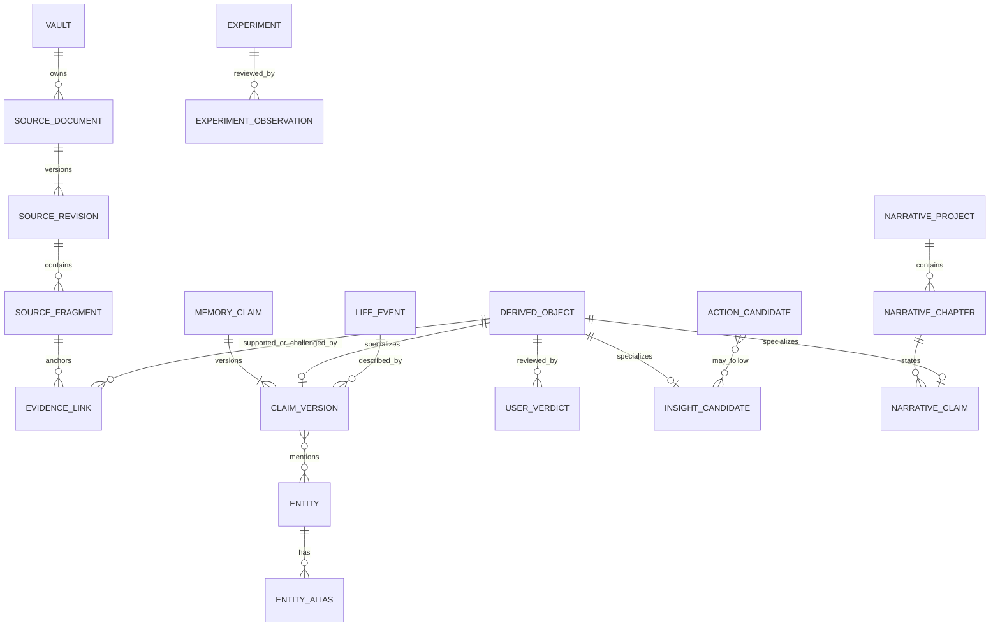

# 领域与数据模型

## 1. 四层认识结构

最重要的数据约束不是某张表，而是以下四层永不混淆：

1. **Source**：用户原话、文件和用户修订，是唯一原始记录与证据来源。它证明“用户曾这样记录”，不自动证明事件客观发生。
2. **Derived**：模型抽出的事件、人物、命题、主题与候选行动，可重建。
3. **Evidence**：Derived 指向 Source 精确片段的支持、反证或上下文关系。
4. **Verdict**：用户对 Derived 的确认、修正、驳回、暂停或撤回。

生成的回答、洞察和回忆录属于 `Artifact`。Artifact 可以引用 Source/Derived，但不得作为新的 Source，除非用户主动将一段内容“采纳为我的记录”，此操作会创建一条明确标注来源的新 Source revision。

## 2. 概念关系



## 3. 通用字段约定

所有业务表至少包含：

```text
id                 UUIDv7 / sortable UUID
vault_id           tenant + privacy boundary
created_at         timestamptz
updated_at         timestamptz（不可变表除外）
created_by         user | system component | import
deleted_at         nullable，读路径立即排除
data_class         normal | sensitive | highly_sensitive
```

规则：

- 时间统一存 UTC，另保留用户当时的 `timezone`；展示时不得用当前时区改写历史日期。
- 用户输入的模糊时间不能伪装成精确时间，另存 `time_precision` 与原始表达。
- 业务查询必须以 `vault_id` 开始，并由 RLS 二次约束。
- 高敏字段使用应用层 envelope encryption；不可把可搜索性当作跳过加密的理由。

## 4. Source：原始材料

### `source_document`

稳定逻辑对象，例如一条 memo、一段录音或一本导入日记。

```text
id, vault_id
source_type         note | conversation | audio | image | file | import
origin              first_party | user_upload | connector
current_revision_id
title
event_time_hint     用户认为内容发生的时间，可空
capture_timezone
processing_state    ready | pending | partial | failed
retention_policy_id
```

### `source_revision`

不可变内容版本。

```text
id, document_id, revision_no
content_ciphertext / object_key
content_mime
content_hash
language
created_at
supersedes_revision_id
edit_origin         user | import_replay | transcription_correction
```

语音原文件、ASR 文本和用户修订的转录分别保留。ASR 不是用户原话的完美副本，需记录引擎、版本与 word-level 时间戳。

### `source_fragment`

```text
id, revision_id
ordinal
char_start, char_end
audio_start_ms, audio_end_ms
text_ciphertext
text_hash
fragment_kind       paragraph | utterance | page | caption
```

证据使用 revision + offset/hash 锚定。原文被编辑后，旧锚点不会悄悄指向新内容；后台尝试重定位并要求检查不确定匹配。

### `search_projection`

应用层密文不能直接由 PostgreSQL FTS 检索。获授权的受限 Worker 在内存中解密片段，生成单独、可删除的搜索投影：

```text
id, vault_id, source_fragment_id UNIQUE
lexical_terms / tsvector
embedding
tokenizer_version, embedding_version
source_generation
index_policy        lexical | semantic | both | none
deleted_at
```

词元和 embedding 仍属于敏感个人数据，只受磁盘加密、RLS、受限角色和保留策略保护，不能被描述成 E2EE。高敏来源默认可走 `index_policy=none`；其原文仍加密保存，但不提供云端全文/语义检索。M0 必须单测中文姓名、短语和原句搜索，并在应用层分词、n-gram/`pg_trgm` 或经许可证与托管验证的中文扩展之间做实测选择，不能默认 PostgreSQL 内置分词足够。

## 5. Derived：生命模型

### `derived_object` 超表

所有可被 evidence 或 verdict 指向的派生对象先在超表登记：

```text
derived_object
  id, vault_id, object_kind, created_at, deleted_at
  UNIQUE(vault_id, id)
```

`claim_version`、`insight_candidate`、`narrative_claim` 等以 `derived_object_id` 作为主键/外键扩展它。这样 evidence、verdict 与删除级联可以使用真实的复合外键 `(vault_id, derived_object_id)`，不使用数据库无法验证的 `target_type + target_id` 多态引用。

### `memory_claim` 与 `claim_version`

`memory_claim` 表示一个长期逻辑命题；`claim_version` 保存它随现实与系统理解的变化。

```text
memory_claim
  id, vault_id
  kind               explicit_fact | preference | value | goal
                     | relationship | self_description | pattern_hypothesis
  subject_entity_id

claim_version
  derived_object_id, claim_id, version_no
  canonical_text
  structured_payload jsonb
  epistemic_type     stated | observed | inferred | user_authored
  attribution        self_report | quoted_other | imported_record | model_hypothesis
  uncertainty_text
  lifecycle_state    candidate | active | disputed | superseded | retracted
  valid_from, valid_to
  valid_time_precision
  system_from, system_to
  confidence_band    low | medium | high
  pipeline_version
  model_run_id
```

`confidence_band` 表示抽取/匹配质量，不表示一个人的自我叙述“客观为真”。界面不展示伪精确概率。

### `entity` 与 `entity_alias`

```text
entity
  id, kind           self | person | organization | place | project | concept
  canonical_label
  resolution_state   unresolved | proposed | confirmed | split

entity_alias
  entity_id
  alias_text
  source_fragment_id
  active_window
```

同名人物和“他/她/老板/妈妈”等代称默认不自动合并。高影响合并需要用户确认；错误合并必须支持 split 并重建受影响投影。

### `life_event`

```text
id, vault_id
event_type
summary
start_time, end_time
time_precision       exact | day | month | year | range | unknown
original_time_phrase
location_entity_id
lifecycle_state
```

事件与 claim、人物通过关联表连接。事件摘要仍必须有证据；“大约大学二年级”不可被模型随意转换成某一天。

### `relation_edge`

关系模型用于主库中的少量明确连接，不追求把全文三元组化：

```text
from_entity_id, predicate, to_entity_id
claim_version_id
valid_from, valid_to
state
```

只同步 `active + confirmed/low-risk explicit` 的关系到可选图投影。

### `goal`、`commitment` 与 `action_candidate`

三者不能混为一张 Todo 表：

```text
goal
  desired_direction, horizon, status, value_links

commitment
  explicit_user_words, due_window, status, source_fragment_id

action_candidate
  proposal_text, rationale, effort, reversibility
  origin              explicit_extraction | coach_suggestion | insight
  state               proposed | accepted | rejected | expired
```

只有 `commitment` 或 accepted `action_candidate` 可以创建 `task`。诸如“以后想学画画”默认是愿望/目标线索，不自动产生截止日期。

### `experiment` 与 `experiment_observation`

Life coach 应优先帮助用户做低风险可逆实验，而不是给绝对建议：

```text
experiment
  hypothesis_id
  chosen_action
  if_then_plan
  duration
  success_definition_user_text
  state

experiment_observation
  outcome_user_text
  happened_at
  perceived_helpfulness
  next_choice            continue | change | stop | undecided
```

观察结果是新的 Source，并通过证据链更新假设，而不是把“完成/失败”变成人格评分。

## 6. Evidence 与用户裁定

### `evidence_link`

```text
id, vault_id
target_derived_object_id
source_fragment_id
relation            supports | contradicts | contextualizes
quote_start, quote_end
quote_hash
extractor_reason
strength_band       weak | moderate | strong
model_run_id
```

约束：

- target 若是模型 Artifact，只能用于显示引用，不能递归成为 memory evidence。
- 一条重要 hypothesis 至少需要两个时间上独立的来源，或由用户明确确认。
- 检索 insight 时既查询 `supports` 也查询 `contradicts`。
- 若来源被排除或删除，evidence 立即失效并触发目标重新评估。

### `user_verdict`

```text
id, vault_id, target_derived_object_id
verdict             confirm | correct | reject | snooze | retract
correction_text
reason_optional
created_at
```

`user_verdict` 是追加事件；确定性 reducer 由事件流计算当前裁定和生命周期状态。用户的 correction 会创建新的 Source revision/claim version，而不是原地改 AI 历史。用户不需要说明驳回理由。

## 7. Insight 与叙事

### `insight_candidate`

```text
id, vault_id
observation
interpretation
uncertainty
open_question
time_window
novelty_score
state               proposed | confirmed | corrected | rejected | expired
generation_run_id
```

产品展示时明确区分“我观察到的材料”和“我的一种解释”。如果没有反证搜索或证据覆盖不足，不能晋升为主动洞察。

### `narrative_project`、`narrative_chapter`、`narrative_claim`

```text
narrative_project
  scope_from, scope_to
  included_source_sets
  excluded_topics
  person_pseudonym_rules
  voice_preferences
  state

narrative_chapter
  outline_version, draft_version
  frozen_context_pack_id
  state

narrative_claim
  sentence_anchor
  claim_type          factual | reflective | literary
  verification_state supported | uncertain | user_authored
```

事实性句子必须引用来源；反思性句子标明是解释；文学性连接可以存在于草稿，但不可被系统当成知识。

## 8. 运行、审计与同意

### `model_run`

```text
id, task_type
provider, model, model_revision
prompt_template_version
schema_version
consent_snapshot_id
started_at, finished_at
status, error_class
token_usage, cost_bucket
output_object_key_encrypted
```

输入引用使用规范化的 `model_run_input_ref` 表，不存多态 ID 数组：一行只能通过 CHECK/FK 指向 `source_revision`、`source_fragment` 或 `derived_object` 之一，所有 FK 同时包含 `vault_id`。普通日志只记录引用数量和 run ID，不记录内容。

### `consent_record`

采用追加式版本，记录用户何时对哪个目的、哪些来源、哪个供应商策略授权或撤回。每次变更递增 vault 的 `policy_epoch`；每次 Source 修改/删除递增 `source_generation`。后台任务引用创建时快照，并在读取内容、外部调用和提交结果三个栅栏点比较当前 epoch/generation。

### `audit_event`

记录谁在何时查看、导出、修改、确认、删除了什么资源，以及系统哪次任务改变了哪条候选状态。审计 payload 只存 ID、动作和必要元数据，不复制内容。

## 9. 双时态约束与矛盾示例

现实有效区间与系统有效区间均使用半开区间 `[from, to)`；`to = infinity/null` 表示当前仍有效。模糊日期另保留 earliest/latest、精度和用户原始表达，不能为了使用 range 而伪造精确时间。

数据库约束：

- 每个 `memory_claim` 只能有一个 `system_to IS NULL` 的当前版本，用 partial unique index 保证。
- 同一 claim 的系统区间不可重叠；新版本在同一事务关闭旧区间并创建新区间。
- 已确认、语义相同的普通事实不应有重叠现实区间；真正矛盾或尚有争议的解释可作为独立 claim 并通过 contradiction 关系并存，不能由 exclusion constraint 擅自删除。
- 所有 as-of 查询同时指定现实时间和系统时间；“我们现在知道的过去”与“系统当时知道的过去”是不同查询。
- verdict 只追加，由 reducer 得出当前状态；并发裁定使用目标版本/ETag，冲突返回 409 而不 last-write-wins。

允许的主要状态迁移：

```text
candidate → active | disputed | retracted
active    → disputed | superseded | retracted
disputed  → active | superseded | retracted
```

`superseded/retracted` 不可原地复活；需要新版本并保留原因与触发 verdict。

用户 2025 年写“我不想当管理者”，2026 年写“我现在愿意试试带团队”。系统不应把前者删除或简单平均：

| 版本 | 现实有效时间 | 系统记录时间 | 状态 | 解释 |
|---|---|---|---|---|
| V1 | 2025-03 ～ 2026-06? | 2025-03-10 | superseded | 当时的明确偏好 |
| V2 | 2026-06 ～ now | 2026-06-18 | candidate/active | 新阶段意愿，等待确认或由明确原话激活 |

查询“我去年怎么看管理”应返回 V1；查询“现在的职业意愿”优先 V2，同时可提示这是一次变化，而不是把过去说成错误。

## 10. 删除级联

删除分两步，第一步必须同步生效：

1. **立即隔离**：设置 tombstone；所有 API、检索、模型上下文、通知和导出排除目标。
2. **异步擦除**：删除对象、正文、片段、embedding、全文索引、图投影、只依赖该来源的 claim/insight、相关 ContextPack 和文稿缓存；处理备份保留窗口。

若一个 claim 还有其他有效来源，它可以保留，但必须移除已删 evidence 并重新计算状态。删除审计只保留无内容的 tombstone（资源类型、删除时间、完成状态），不能保留原文摘要。

必须有自动化删除测试：在 API、FTS、向量、缓存、图适配器、对象存储和生成上下文上搜索独特 canary，结果全部为空才算完成。
