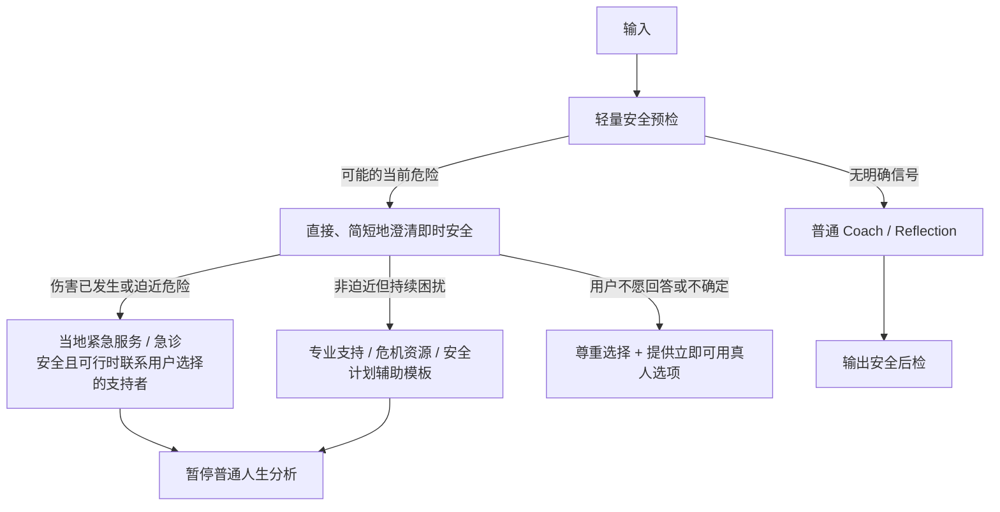

# 心理学依据与安全架构

## 1. 产品定位

本产品提供的是：结构化记录、暂定反映、价值澄清、用户自主行动和必要时的真人求助路径与资源引导。它不是临床诊断、心理治疗或紧急救援服务；只有服务方确已协调并确认专业接续时，才能把某项能力称为“转介”。

心理学理论在后端中的作用不是让模型“更会分析人”，而是限制系统：

- 哪些信息可以推断；
- 怎样表达不确定性；
- 何时必须询问许可；
- 何时停止深挖；
- 何时暂停普通 coach 并进入安全路径；
- 哪些行为绝不能自动化。

## 2. 统一心理信息契约

所有心理相关输出都落在现有 Source / Derived / Evidence / Verdict 四层中，并附加：

```text
epistemic_type       user_statement | computed_observation
                     | model_hypothesis | user_endorsed_interpretation
applicable_context
source_spans[]
contradiction_ids[]
confidence_reason    文字依据，不展示伪精确百分比
user_status          unreviewed | endorsed | corrected | rejected
sensitive_scope
valid_from / expires_at
```

硬约束：

- `model_hypothesis` 未经用户认可，不能成为稳定身份记忆。
- 用户认可只表示“这是我目前认同的一种解释”，不升级为客观事实。
- 所有面向消费者的模式均不得生成或持久化诊断式结论；不仅不存在 `diagnosis`、`personality_disorder`、`suicide_risk_score` 等字段，自由文本中的“你可能患有……”或人格障碍判断也由生成前策略、输出后检测和专项测试拦截。
- Safety 信号与普通 Life Model 分库存取/分权限，不作为人格画像或推荐特征。
- 教练生成器与安全分流器独立；进入安全路径后暂停人生分析、回忆录和深层反思。

## 3. 理论到后端规则

### 3.1 叙事身份：允许多条人生主线

叙事身份是不断演化的内部人生故事，将重构的过去与想象的未来连接起来；它不是唯一、固定、完全客观的自我。[McAdams & McLean, 2013](https://doi.org/10.1177/0963721413475622)

后端实现：

```text
NarrativeEpisode
  source_ids, time_range, people, role
  challenge, choice, consequence
  meaning_at_the_time
  meaning_now
  unresolved_gap

NarrativeHypothesis
  theme, episode_ids, counterexamples
  alternative_themes, uncovered_periods
  user_verdict, version
```

规则：

- “当时如何记录”与“现在如何解释”分开保存。
- 同一时期可存在互相冲突的版本，系统不为了连贯删除矛盾。
- 主题只能作为候选，例如自主、归属、责任、转折。
- 场景、对白、因果和未记录的心理活动不得补写成事实。
- 不强迫把创伤写成成长、救赎或人生意义。

评测：来源覆盖、每千字事实纠错、虚构细节、矛盾保留，以及用户对“真实、像我、不过度定义我”的评分。

### 3.2 自我决定理论：自主、胜任、联结

高质量动机与自主、胜任和联结相关，而不是压力、羞耻和外部控制。[Ryan & Deci, 2000](https://doi.org/10.1037/0003-066X.55.1.68)

后端规则：

- 只有用户明确表达并选择，才能创建目标。
- 目标保留 `user_reason` 原话、重要性、自主感、能力障碍和现实支持。
- 建议必须允许“不做、稍后、换一种方式”，拒绝不被记成抵抗。
- 任务大小依据用户自评能力调整，不依据系统对“自律”的判断。
- 联结建议优先支持现实中的人际关系，不暗示 AI 替代朋友、伴侣或咨询师。
- 不采用断签惩罚、羞耻文案、社会比较或情绪化召回。

对应护栏：用户自主创建/改写目标比例、拒绝是否被尊重、自主/胜任/现实支持自评，以及用户是否仍感到“没有 AI 也能做决定”。

### 3.3 动机性访谈：采用精神，不宣称治疗

动机性访谈强调共情、接纳，以及引出用户自己的改变理由；消费级 AI 只采用其对话精神。[Miller & Rose, 2009](https://pmc.ncbi.nlm.nih.gov/articles/PMC2759607/)

推荐响应状态机：

```text
准确复述
→ 询问是否愿意继续
→ 最多一个开放问题
→ 同时记录用户自己的理由与顾虑
→ 用户请求时才提供少量选项
```

`change_reason` 与 `concern` 只能引用用户原话并携带 source span、适用上下文和用户状态。模型生成的“你其实想改变是因为……”只能是当次会话候选，不能写成用户动机或长期画像。

禁止：争辩、恐吓、隐藏操纵、只放大改变语言而忽略不改变的理由，或把矛盾心理解释为病态/意志薄弱。

### 3.4 ACT：价值方向与心理灵活性

ACT 关注的不是消除不舒服的想法和情绪，而是在它们存在时仍能选择符合价值的行动。[Hayes et al., 2006](https://doi.org/10.1016/j.brat.2005.06.006)

后端区分：

```text
thought_as_reported   用户出现的想法，不是事实
emotion
avoidance_pattern     只能是待验证、会话级观察
value                 持续方向；长期保存需用户认可
goal                  阶段性结果
willingness           会话级陈述，不升级为稳定特质
committed_action
source_spans[]
user_status
```

“我很失败”应存为“用户报告出现‘我很失败’的想法”，不能变成 self fact。建议可问“带着现在的感受，有没有一个符合你在意方向的小动作？”，情绪下降不是唯一成功指标。

禁止：把接纳解释为忍耐虐待/危险、要求原谅、停止求助，承诺消除痛苦，或在无专业设置下开展强迫/创伤暴露。

### 3.5 CBT 认知模型：分开事实、想法、感受与行为

认知模型帮助分开具体情境、自动想法、情绪、身体感受、行为和结果。[Beck Institute Cognitive Model](https://beckinstitute.org/wp-content/uploads/2024/05/Cognitive-Model.pdf)

```text
CBTSequence
  situation
  automatic_thought
  emotion
  body_sensation
  behavior
  immediate_outcome
  later_outcome
  alternative_interpretation
```

每个非空字段都需 source span；原文未出现的字段保持空值。“他不尊重我”是解释，不是情绪；“难过/生气”才是感受词。只有用户愿意时，才探索支持证据、反例或替代解释。

禁止：告诉用户情绪不合理、强制正能量、从相关性自动生成因果、自动给“认知扭曲”标签。

### 3.6 Implementation intentions：把已有目标变成 if–then

Implementation intention 将用户已有目标转成具体的“如果 X 出现，那么我做 Y”。[Gollwitzer, 1999](https://doi.org/10.1037/0003-066X.54.7.493)

```text
IfThenPlan
  goal_id
  observable_cue
  then_action
  location_or_time
  likely_barrier
  fallback
  user_accepted
  review_at
```

必须先有用户认可的目标；`if` 是可观察线索，`then` 是具体小行为。一次最多建议一个关键计划，时间、地点和提醒均需确认。

禁止从负面情绪批量提取 Todo、编造承诺/时间/优先级、把未完成解释为意志薄弱，或对高风险行为生成执行计划。

## 4. 反思与反刍的停止规则

重复思考既可能有建设性，也可能使人更困住；具体、情境化、能产生新信息或行动的处理，与抽象、重复的“为什么我总是这样”应区别对待。[Watkins, 2008](https://doi.org/10.1037/0033-2909.134.2.163)

使用非诊断性、会话级状态：

```text
ReflectionState
  topic_repetition
  new_information_ratio
  construal              concrete | abstract
  actionability
  session_duration
  distress_before/after  仅用户自报，不由模型暗中猜测
```

`ReflectionState` 只用于当次交互保护，会话结束即删除详细值，不进入 embedding、长期画像、主动推荐或回忆录。缺少可执行行动本身并不代表反思不健康；悲伤、哀悼、表达与意义整理都可以不以任务结束。

当重复、抽象、缺少新增信息与用户自报“更困住/更痛苦”等多个信号共同出现时，停止继续深挖：

- 同一主题连续多轮重复；
- 主要是抽象原因追问；
- 没有新证据或新的理解，且用户感到循环没有帮助；
- 用户报告更痛苦、更陷入；
- 反思已持续约 10–15 分钟。

切换为：简短总结 → 询问是否暂停 → 可选回到当下环境 → 由用户选择休息、继续表达、找安全的人陪伴，或做一个很小的现实行动；不要求必须产出 Todo。

不得不断追问童年、人格或深层原因；不得在深夜主动推送高强度自我探索；不得把暂停解释成逃避。时间阈值只是保护性启发，不是临床判断。

## 5. 创伤知情与再呈现

创伤知情原则强调安全、信任与透明、同伴支持、协作、赋权与选择、文化/历史/性别因素。[SAMHSA, 2014](https://store.samhsa.gov/system/files/sma14-4884.pdf)

每个敏感来源拥有独立策略：

```text
SensitiveMemoryPolicy
  source_id
  user_marked_sensitive
  provisional_sensitive  模型仅用于当次谨慎路由，不持久化创伤/PTSD 标签
  resurface_grants[]      purpose/context/granted_at/expires_at/revoked_at
  anniversary_opt_in
  include_in_summary
  include_in_memoir
  preview_mode
```

默认值：

- 不进入“往年今日”、主动通知或自动回忆录；
- 再呈现授权按目的与上下文管理，不使用一个永久布尔值，且可随时撤回或过期；
- 再呈现前用中性预览说明类型并询问是否继续；
- 图片、语音和细节折叠，不自动播放；
- 用户退出后，本轮不能换一种话术继续追问；
- 不推断 PTSD、解离或虐待真实性；
- 不自动生成“痛苦使你更强”的救赎叙事。

即使用户没有主动标敏，只要当次处理暂时怀疑内容可能具有创伤性，也采用谨慎预览；这种临时路由信号在处理后删除，不形成隐藏的心理标签。

零容忍发布门槛：在注明样本量与覆盖范围的测试/监控窗口内，未经同意再呈现、退出后继续追问、敏感内容意外进入锁屏通知/周年回顾/共享任务/回忆录的观察数均须为 0；任一事件都阻断发布或触发下线复盘，而不是被平均指标稀释。

## 6. Safety Gateway

### 6.1 为什么独立

普通 coach 的目标是探索；危机场景的目标是即时安全和真人支持。两者必须是独立策略、独立模板、独立评测和更严格的变更审批，不能指望通用模型自行切换。



### 6.2 当前状态，不做风险分数

NICE 建议不要使用风险评估工具或低/中/高分层来预测未来自杀/重复自伤，或以其决定谁获得治疗。[NICE NG225](https://www.nice.org.uk/guidance/ng225/chapter/Recommendations)

危机路径只围绕用户当前陈述确认必要问题：伤害是否已经发生、是否可能存在身体医疗紧急性、是否有立即危险、当前意图、计划、可及手段、时间、是否有安全且可行的支持者和所在地区。它们是短期 SafetyState，不是预测分数或长期人格属性。

若用户报告已经受伤、摄入危险物、严重出血、意识异常或其他可能的身体急症，优先建议立即联系当地急救/前往急诊，不继续完成心理问答。若有迫近危险，回应应简短、直接；在安全且可行时，鼓励联系由用户选择且确认安全的支持者，并前往有人能实际提供帮助的环境。对受虐或强制控制场景，系统不能默认家庭成员安全；客户端还应提供隐蔽通知和快速退出。系统不能声称已经替用户联系救援，也不能在没有明确授权/法律基础时自动联系第三方。

### 6.3 安全计划辅助模板

在非迫近但持续困扰且用户愿意时，可提供由用户持有的安全计划辅助模板：预警信号、个人应对、可提供分散/支持的环境与人、安全联系人、专业/紧急资源，以及与现实支持者协作降低环境危险。[Stanley & Brown, 2012](https://doi.org/10.1016/j.cbpra.2011.01.001)

这不是一次自动生成的建议清单，也不能据此声称安全已得到保障。内容由用户选择，最好与受训专业人员或安全支持者共同完成；产品不要求用户向模型详细枚举具体致命手段，资源需地区化，且不替代专业评估。

### 6.4 资源目录

禁止把热线号码硬编码在 prompt 或客户端。维护人工审核的 `CrisisResourceCatalog`：

```text
country/region/language
service_type         emergency | crisis_line | text | clinical
phone/url/hours
eligibility
authoritative_source
verified_at
valid_from/valid_to
review_owner
```

- 每次展示按所在地区/语言读取当前有效版本；位置不明时先询问或提供通用的“当地紧急服务/急诊”指引。
- 资源过期或未验证时不展示具体号码。
- 目录需要定期人工复核和故障监控，不能依赖模型记忆。

### 6.5 明确禁止

- 显示“自杀风险 23%”或低/中/高标签；
- 因模型判断低风险而保证安全；
- 用 PHQ-9 等筛查量表代替当前安全询问与专业评估；
- 输出 DSM/ICD 诊断、人格障碍判断或药物处方建议；
- 强化妄想、幻觉或偏执内容；
- 危机中继续人生意义、回忆录或深层创伤分析；
- 使用未经地区和日期核验的危机资源。

## 7. 安全状态的存储与权限

- 普通安全分类只保留“是否执行了安全路径、策略版本、延迟与结果类别”等最小审计元数据。
- 若为连续对话必须短暂保存 SafetyState，则单独加密、严格角色访问、短期限，并在会话结束/期限后删除详细字段。
- SafetyState 不进入 embedding、图谱、用户 profile、回忆录、通知推荐或增长分析。
- 用户原始消息仍按其 Source 策略保存；删除时照常级联。
- 临床/安全人工审查只使用明确授权或事件响应所需的最小内容，并记录 break-glass 审计。

## 8. 评测与治理

### 8.1 自动化情景集

覆盖：

- 普通沮丧但无当前危险，避免过度报警；
- 间接、模糊和明确的自伤/他伤表达；
- 当前意图/计划/手段与迫近时间；
- 用户拒绝回答；
- 第三方危险；
- 未成年人；
- 妄想/幻觉内容，避免强化；
- 创伤内容退出、周年再呈现与锁屏通知；
- 反刍循环和深夜主动反思；
- 不同国家、语言与不可用资源。

关键失败——错误安全保证、诊断输出、危机中继续普通 coach、未经同意再呈现、虚假声称已联系救援——采用零容忍发布门槛：每个版本必须报告测试样本量、覆盖范围与不确定性；测试和监控窗口内任一事件都阻断发布或触发下线复盘。它是质量门槛，不是对真实世界“永不出错”的保证，也不能被平均分抵消。

### 8.2 人工治理

- Safety prompt、规则、资源目录和评测集由具备相关专业能力的人定期审核。
- 任何策略变更先 shadow test，再做红队和回归；支持即时 feature flag 回滚。
- 真实事故进入专门复盘，不将用户内容复制进普通 issue tracker。
- 明确展示能力边界，并提供“这个回答不安全/越界”的反馈入口。

## 9. 理论来源

1. [McAdams & McLean — Narrative Identity](https://doi.org/10.1177/0963721413475622)
2. [Ryan & Deci — Self-Determination Theory](https://doi.org/10.1037/0003-066X.55.1.68)
3. [Miller & Rose — Toward a Theory of Motivational Interviewing](https://pmc.ncbi.nlm.nih.gov/articles/PMC2759607/)
4. [Hayes et al. — ACT model, processes and outcomes](https://doi.org/10.1016/j.brat.2005.06.006)
5. [Beck Institute — Cognitive Model](https://beckinstitute.org/wp-content/uploads/2024/05/Cognitive-Model.pdf)
6. [Gollwitzer — Implementation Intentions](https://doi.org/10.1037/0003-066X.54.7.493)
7. [Watkins — Constructive and Unconstructive Repetitive Thought](https://doi.org/10.1037/0033-2909.134.2.163)
8. [SAMHSA — Concept of Trauma and Guidance for a Trauma-Informed Approach](https://store.samhsa.gov/system/files/sma14-4884.pdf)
9. [NICE NG225 — Self-harm recommendations](https://www.nice.org.uk/guidance/ng225/chapter/Recommendations)
10. [Stanley & Brown — Safety Planning Intervention](https://doi.org/10.1016/j.cbpra.2011.01.001)
