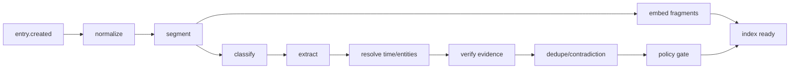

# API、后台任务与集成

## 1. API 原则

- 对外使用版本化 REST；流式对话与后台进度用 SSE。MVP 不为此引入 WebSocket。
- 写请求支持 `Idempotency-Key` 和乐观并发 `If-Match` / revision。API 幂等账本按 `(vault_id, operation, client_key)` 作用域保存请求哈希与响应引用；同键不同请求返回冲突，不能跨 vault/路由复用。
- 资源状态与 AI 处理状态分开：记录已保存，不代表已经完成抽取。
- 所有 AI 结果返回 `sources`、`uncertainties` 和用户可执行的 verdict actions。
- 高成本操作返回 job/project 资源，不保持长 HTTP 请求。
- 删除、导出、外部副作用使用明确命令端点并记录审计。

## 2. MVP API 面

### 2.1 Source 与导入

| 方法 | 路径 | 用途 |
|---|---|---|
| `POST` | `/v1/entries` | 写文本/对话记录，立即返回 |
| `GET` | `/v1/entries` | 时间流、过滤、游标分页 |
| `GET` | `/v1/entries/{id}` | 原文、版本与处理状态 |
| `PATCH` | `/v1/entries/{id}` | 创建新 revision，不原地覆盖 |
| `DELETE` | `/v1/entries/{id}` | 立即隔离并启动删除级联 |
| `POST` | `/v1/assets/uploads` | 获取绑定 vault/object key 的一次性预签名上传，初始为 quarantine |
| `POST` | `/v1/assets/{id}/finalize` | 校验一次性 token、object key、checksum、大小和 MIME 后提交隔离扫描 |
| `POST` | `/v1/imports` | 创建预览式导入任务 |
| `GET` | `/v1/imports/{id}` | 查看解析预览与警告 |
| `POST` | `/v1/imports/{id}/commit` | 用户确认后正式纳入 |

`POST /entries` 示例：

```json
{
  "content": "今天和小李谈完，我发现自己并不是不想带团队，而是害怕做不好。",
  "captured_at": "2026-08-23T20:10:00+08:00",
  "memory_policy": "default",
  "client_id": "local-uuid"
}
```

```json
{
  "id": "...",
  "revision": 1,
  "saved": true,
  "processing": {"state": "pending"}
}
```

### 2.2 Memory 与证据

| 方法 | 路径 | 用途 |
|---|---|---|
| `GET` | `/v1/memories` | “系统记得的我”，按类型/状态/时间筛选 |
| `GET` | `/v1/memories/{id}` | 版本、来源、反证、使用范围 |
| `POST` | `/v1/memories/{id}/verdicts` | 确认、修正、驳回、撤回 |
| `POST` | `/v1/memories/{id}/suppress` | 禁止主动使用/提醒，可设置范围 |
| `GET` | `/v1/memory-inbox` | 批量审阅候选，避免频繁弹窗 |
| `POST` | `/v1/memory-inbox/batch-verdict` | 批量裁定低风险候选 |

返回记忆时至少包含：

```json
{
  "statement": "你可能正在重新评估管理岗位",
  "epistemic_type": "inferred",
  "state": "candidate",
  "valid_time": {"from": "2026-06", "precision": "month"},
  "evidence": [{"entry_id": "...", "quote": "...", "relation": "supports"}],
  "counterevidence": [],
  "allowed_uses": ["answer_when_asked"]
}
```

### 2.3 搜索与 Coach

| 方法 | 路径 | 用途 |
|---|---|---|
| `POST` | `/v1/search` | 原文/事件/人物/记忆统一搜索 |
| `POST` | `/v1/coach/sessions` | 创建带独立记忆策略的会话 |
| `POST` | `/v1/coach/sessions/{id}/runs` | 原子保存消息并创建生成 run，返回 run ID |
| `GET` | `/v1/runs/{run_id}/stream` | 订阅该 run 的 SSE 流 |
| `GET` | `/v1/runs/{run_id}` | 读取当前加密快照或最终权威结果 |
| `GET` | `/v1/context-packs/{id}/explanation` | 为什么使用这些材料 |

Coach 会话必须允许：仅本轮、不进入长期记忆、禁用主动推断、选择某个时间/项目范围。

### 2.4 洞察、行动与实验

| 方法 | 路径 | 用途 |
|---|---|---|
| `GET` | `/v1/insights` | 洞察候选与历史裁定 |
| `POST` | `/v1/insights/{id}/verdicts` | 确认/修正/驳回/稍后 |
| `GET` | `/v1/action-candidates` | 明确承诺和建议分开展示 |
| `POST` | `/v1/action-candidates/{id}/accept` | 用户接受后创建内部 task/experiment |
| `POST` | `/v1/experiments` | 用户自己创建行为实验 |
| `POST` | `/v1/experiments/{id}/observations` | 复盘结果，形成新 Source |

### 2.5 人生手稿

| 方法 | 路径 | 用途 |
|---|---|---|
| `POST` | `/v1/narratives` | 创建范围和隐私规则 |
| `POST` | `/v1/narratives/{id}/material-audit` | 生成时间覆盖与缺口 |
| `POST` | `/v1/narratives/{id}/outlines` | 生成可编辑提纲 |
| `POST` | `/v1/narratives/{id}/chapters/{id}/drafts` | 异步生成单章 |
| `GET` | `/v1/narratives/{id}/claims` | 逐句来源与不确定项 |
| `POST` | `/v1/narratives/{id}/exports` | 创建 Markdown/Docx/PDF 导出 job |

### 2.6 同意与数据权利

| 方法 | 路径 | 用途 |
|---|---|---|
| `GET/PUT` | `/v1/privacy/consents` | 功能与目的级同意 |
| `GET/PUT` | `/v1/privacy/resurfacing` | 敏感主题再呈现规则 |
| `POST` | `/v1/exports` | 全量或范围导出 |
| `POST` | `/v1/deletions` | 范围删除/账号删除 |
| `GET` | `/v1/deletions/{id}` | 查看各存储级联进度 |
| `GET` | `/v1/audit-log` | 用户可读的数据使用历史 |

## 3. 错误与并发

统一问题格式：

```json
{
  "type": "https://product.example/problems/revision-conflict",
  "title": "记录已在另一设备更新",
  "status": 409,
  "code": "REVISION_CONFLICT",
  "trace_id": "...",
  "safe_detail": "请刷新后合并。"
}
```

- 不在错误详情回显私密原文或供应商响应。
- 409 提供可合并版本，绝不 last-write-wins 覆盖日记。
- 429 区分用户配额与供应商拥塞；记录保存不受 AI 配额影响。
- AI 暂时失败返回 `processing=delayed/partial`，而不是让客户端重传原始内容。

## 4. SSE 事件

```text
entry.processing.updated
memory.candidates.ready
insight.ready
coach.response.delta
coach.response.completed
narrative.chapter.progress
export.ready
deletion.progress
```

控制事件只带资源 ID、状态和安全摘要，并以每个 run 内持久递增的 event ID 保存有限期限；客户端可用 `Last-Event-ID` 恢复。`coach.response.delta` 含正在显示的内容但不进入普通日志，默认是短暂流、不保证逐 token 重放；断线后客户端先 `GET /v1/runs/{id}` 取得受权限保护的当前加密快照/最终结果，再从最近持久控制事件继续。完成后的权威答案永远来自 run 资源，不由客户端拼接 delta 决定。

## 5. Outbox 与 Job 模型

### 5.1 内部任务与 Outbox 的原子边界

```text
BEGIN
  INSERT domain rows
  INSERT job(...)                 # 当前服务必须完成的内部任务
  INSERT outbox_event(...)        # 仅在需要发布领域事件时，可选
COMMIT
```

普通摄取不先写 outbox 再二次转换，而是与 Source 在同一事务直接插入 job。Outbox 仅用于一个或多个订阅者的领域事件；若订阅者需要把事件物化成 job，则在同一数据库事务内执行 `INSERT ... ON CONFLICT`，以 `(outbox_event_id, job_type)` 去重，再标记 dispatched。两种 payload 都只含 `vault_id/resource_id/pipeline_version`，不含日记正文。

### 5.2 `job` 表

```text
id
vault_id
job_type
resource_id
resource_revision_id
pipeline_version
idempotency_key
outbox_event_id       nullable
state              queued | running | waiting | retrying | done | dead | canceled
priority
attempts, max_attempts
run_after
lease_owner, lease_expires_at, lease_generation
last_error_class, safe_error_message
consent_snapshot_id, policy_epoch, source_generation
created_at, completed_at

UNIQUE(vault_id, job_type, resource_revision_id, pipeline_version)
UNIQUE(outbox_event_id, job_type) WHERE outbox_event_id IS NOT NULL
```

全局 Dispatcher 只能读取/领取无正文的 `(job_id, vault_id, lease_generation)` 元数据；领取使用基于数据库 `now()` 的单条 `UPDATE ... RETURNING` 并递增 generation。Processor 随后开启单 vault 事务并执行 `SET LOCAL app.vault_id`，无表 owner/`BYPASSRLS` 权限。心跳和最终写入都必须携带当前 `lease_generation`；旧 Worker 租约过期后即使继续运行，也不能覆盖新 Worker 结果。

Worker 在取内容前、每次外部模型调用前、提交派生结果前分别检查 `policy_epoch`、`source_generation` 和 tombstone。任一变化都取消或丢弃返回结果，重试/租约恢复执行 no-op。外部调用设置 timeout、指数退避和 jitter；确定性输入错误直接 dead-letter，不做无意义重试。

### 5.3 队列与限流

```text
interactive       Coach 必需的检索/安全步骤，高优先级
ingest_text        切分、抽取、embedding
media              ASR/OCR，资源密集
reflection         可延后、按用户公平调度
narrative          长文任务，严格预算
privacy_critical   删除、撤回同意、索引清除，最高可靠性
integration        日历/Todo 等外部调用
```

- `privacy_critical` 使用独立 Worker pool、预留数据库连接和升级告警，不与长文生成争抢资源。
- 限流键包含 provider、model、task type 与 vault，避免一个大用户饿死其他用户。
- 每个 vault 同一 Source 的摄取按版本串行，独立 Source 可并行。
- 成本预算在领取任务和每次模型调用前检查。

## 6. 任务图

### 6.1 文本摄取



### 6.2 音频摄取

```text
asset.upload_finalized
→ verify vault-bound object key / checksum / type / size
→ quarantine malware scan
→ asset.committed
→ ASR + word timestamps
→ transcription preview（低质量时先让用户修订）
→ confirmed/accepted transcript revision
→ 复用文本摄取管线
```

高影响抽取不应建立在低置信 ASR 上；说话人分离错误要显式展示。

### 6.3 删除

```text
deletion.requested
→ 同步 tombstone + revoke access
→ bump policy/source generation + cancel queued jobs
→ running jobs 在调用/提交栅栏丢弃结果
→ source/object erase
→ FTS/vector purge
→ evidence invalidate
→ claim/insight/artifact recompute or delete
→ graph/integration purge
→ cache purge
→ canary verification
→ completed / exception review
```

## 7. 调度与主动触达

- 调度器只产生候选运行，不直接生成通知。
- Notification policy 检查时区、安静时段、频率上限、主题 suppression、最近驳回与风险状态。
- 日/周/月回顾按“有新信息”触发，而不是硬性产出。
- 用户连续不响应时自动降低频率，不用焦虑文案召回。
- 所有主动触达一键关闭，关闭不影响被动记录与搜索。

## 8. 第三方 Todo / Calendar 集成

外部连接分三层授权：

1. 连接账号并选择最小 OAuth scope；
2. 允许某类操作，例如“创建草稿事件”；
3. 对具体 payload 最终确认，例如标题、时间、参与者。

默认只创建草稿或单向写入用户确认的内容。系统不得把私密反思、心理假设或来源引文放进共享日历/任务标题。Webhook 入站内容视为不可信数据，并受同一摄取与注入防护。

连接器使用独立 `outbound_operation` 账本，按 `(vault_id, connector, operation, local_resource_version)` 去重并记录 request hash、external ID 和状态。超时导致结果未知时先向供应商查询/对账，不盲目重试以免创建重复任务。撤销连接后清除 token，并允许用户选择是否删除已导入内容。

## 9. 何时迁移 Hatchet / Temporal

先用 DB jobs；出现以下至少两项再做 Hatchet PoC：

- 多步 DAG 和条件分支大量重复实现；
- 需要可靠等待用户数天后继续；
- 供应商级复杂限流与并发治理；
- 重试/死信可视化成为运维瓶颈；
- Worker 种类和部署语言明显增加。

Temporal 只在强事件重放、数月工作流和更大服务拓扑已成为实际约束时评估。AI 原始 prompt/正文仍不能直接散落在工作流历史中。
